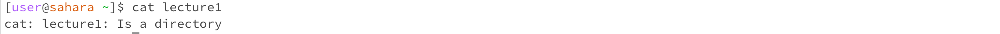

# Lab Report 1
---
* `cd`
  - no arguments:
  - At this time, the working directory was `/home`, we got the following output since we didn't provide any paths, 
    and thus we recieved no output and our working directory didn't change
  - However, when going back and trying from the working directory `/saketh/Downloads`, when using `cd` with no arguments our working directory went out back to just `/saketh`.
  - This was not an error
  - 
  - 
  - path to directory:
  - At this time, the working directory was `/home`, and our working directory changed to `/home/lecture1` since that 
    our intended change
  - This was not an error 
  - 
  - path to file:
  - At this time, the working directory was `/home/lecture1`, and our output occurred since `Hello.java` isn't a directory,
    and we cannot change our working directory into it
  - This was an error since we provided a file when asked for a directory
  - 

* `ls`
  - no arguments:
  - At the time, the working directory was `/home`, and our output gave us a list of all the objects in `/home`
  - This was not an error
  - 
  - path to directory:
  - At the time, the working directory was `/home`, and when provided with `/home/lecture1`, this command gave
    us all of the objects in lecture 1
  - This was not an error
  -  
  - path to file: 
  - At the time the working directory was `/home`, and when provided with `/home/lecture1/Hello.java`, we got back
    the path that we specified
  - This was not an error
  - 

* cat
  - no arguments:
  - At the time, the working directory was `/home`, and the reason we got this output is the program was expecting 
    an input but got none so the terminal didn't know what to do
  - This was an error, since we didn't provide the proper input and the command messed with the terminal
  - 
  - path to directory:
  - At the time, the working directory was `/home`, and the reason we got this output is because our input was recognized  
    as a path to a directory, and the program returned that this was an improper input
  - This was not an error
  - 
  - path to file: 
  - At the time, the working directory was `/home`, and this was the correct input, since we specified a file to concatenate
    and our command correctly wrote out the contents of the specified file
  - 
