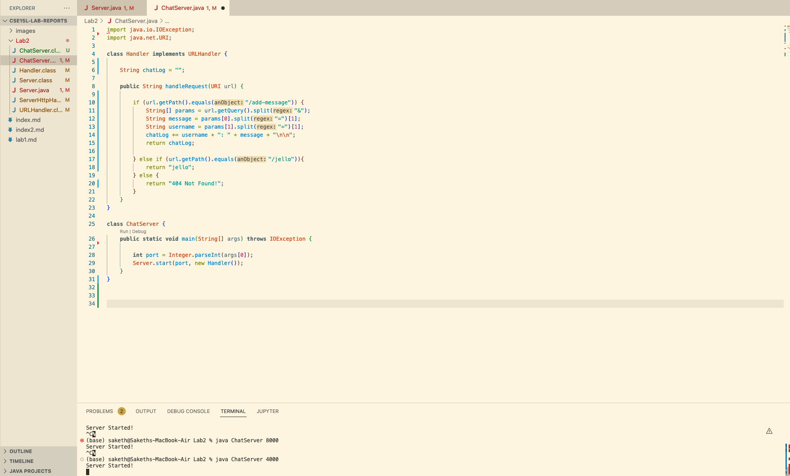
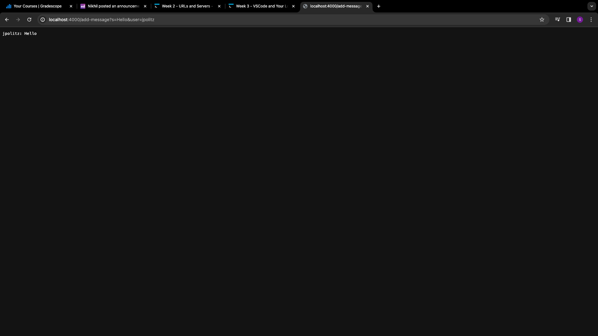
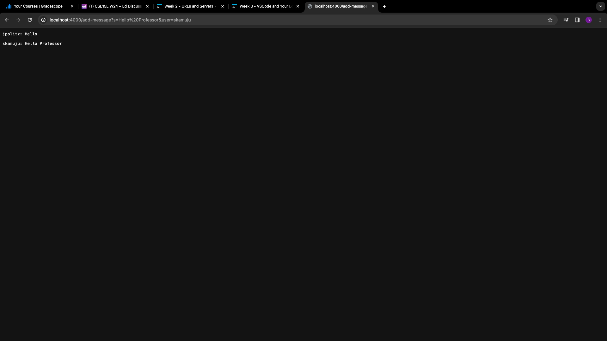
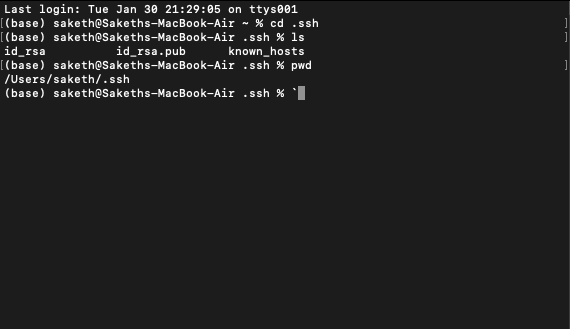
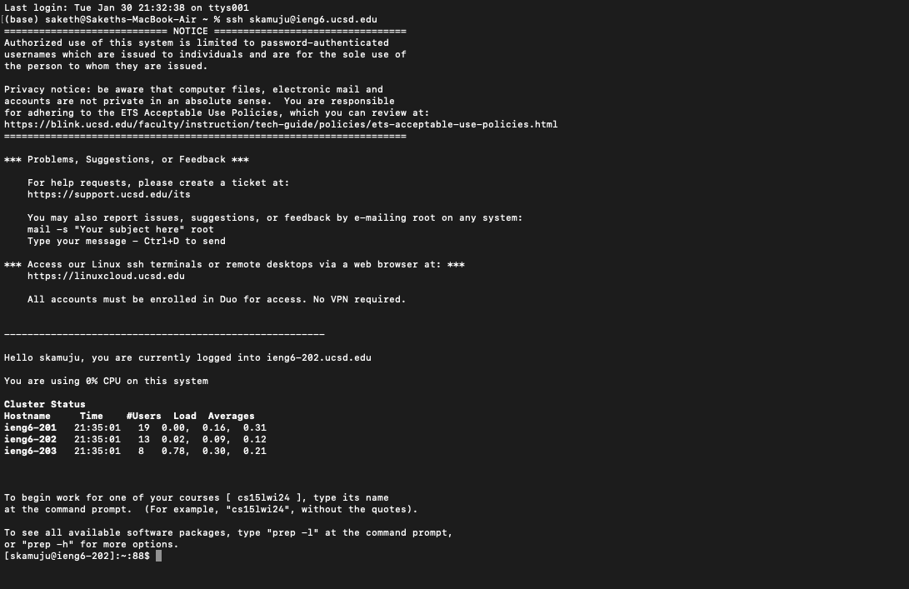

# Lab Report 2
---
* Part 1:
  - My Code: This code uses and is inspired by code written by others, specifically using Server.java and being inspired by NumberServer.java from [this repository](https://github.com/ucsd-cse15l-f23/wavelet).
    - 
  - Usage 1: `{User: jpolitz, Message: Hello}`
    - 
    - In this screenshot, the arguments for handleRequest are everything after the `?`, or `s=Hello&user=jpolitz`
    - In this screenshot, the methods called are first the main method within our ChatServer class. In this method, we create a new Handler object which invokes the handleRequest method in our Handler class. 
    - When this method is called, we create our `chatLog` String, and it starts as an empty String `"`. Based off of the url Path, we ideally get the path  `/add-message` which then creates the String list `params`, which further splits the provided query by the &. From  `params`, we create `message` and `username`. Finally, we update `chatLog` with these variables along with adding a new line so the next messsage doesn't appear on the same line. Finally, our method returns `chatLog `, which is `"jpolitz: Hello + \n\n"`. 
  - Usage 2: `{User: skamuju, Message: Hello Professor}`
    - 
    - In this screenshot, the arguments for handleRequest are everything after the `?`, or `s=Hello%20Professor&user=skamuju`
    - In this method, we use the existing Handler object which invokes the handleRequest method in our Handler class.
    - This method then uses the existing `chatLog` String, which starts as `"jpolitz: Hello + \n\n"`. Based off of the url Path, we get `/add-message` which then once again creates the String list `params`, which further splits the provided query by the &. From  `params`, we create `message` and `username`. We then update  the existing `chatLog` String which already has our previous usage with these variables along with adding a new line so the next messsage doesn't appear on the same line. Finally, our method once again returns `chatLog`, which ends at `"jpolitz: Hello + \n\n" skamuju: Hello Professor + \n\n`. 
* Part 2:
  - 
  - From this image, we can see that the absolute path to my private key for my SSH key for logging into `ieng6` is `/Users/saketh/.ssh/id_rsa`
  - From this image, we can see that the absolute path to my public key for my SSH key for logging into `ieng6` is `/home/linux/ieng6/oce/0l/skamuju/.ssh/id_rsa.pub`
  - Here we can see an example of me logging into my account on `ieng6` without entering my password
  - 
* Part 3:
  - From this lab in week 3, I gained a much better understanding of how websites can handle queries. In the process of creating this simple webserver, I had to research how a my program could take in the given query from the url path and then use that to output the desired content.
