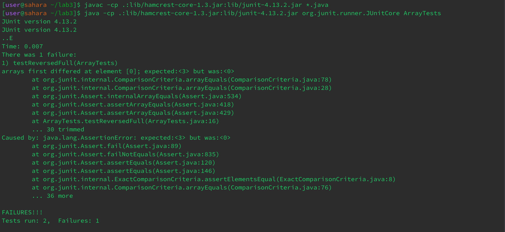
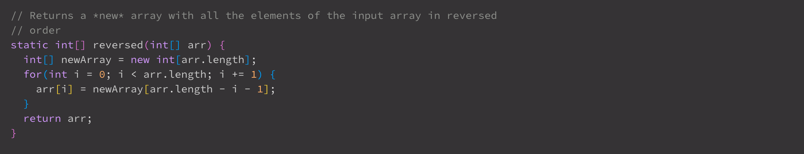
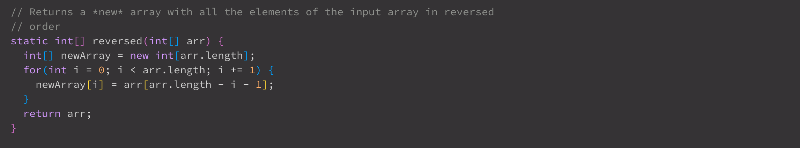

# Lab Report 3
---
* Part 1:
  - failure inducing input for the `reversed()` method from `ArrayExamples`:
  - `@Test
  public void testReversedFull() {
    int[] input = new int[]{1,2,3};
    int[] revInput = new int[]{3,2,1};
    assertArrayEquals(revInput, ArrayExamples.reversed(input));
    }`
  - non-failure inducing input for the `reversed()` method from `ArrayExamples`:
  -  `@Test
  public void testReversedEmpty() {
    int[] input = new int[]{};
    assertArrayEquals(input, ArrayExamples.reversed(input));
    }`
  - Symptom:
  - 
  - Bug Before:
  - 
  - Bug After (Fixed):
  - 
  - The problem with this code originally was that instead of properly updating `newArr` with the corresponding elements from our input `arr`, it would try and update `arr`'s elements with nonexistend elements from `newArr`, and finally try to return `arr`.
  - To fix this code, all I had to do was ensure the `newArr` was being updated with the proper elements from the input, `arr`, and update the return statement so that `newArr` was being returned.
* Part 2:
  - For this part of the lab report, I chose to focus on the `find` command
  - 
