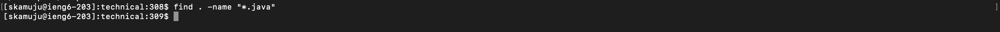

# Lab Report 3
---
* Part 1:
  - failure inducing input for the `reversed()` method from `ArrayExamples`:
 ```
     @Test
    public void testReversedFull() {
    int[] input = new int[]{1,2,3};
    int[] revInput = new int[]{3,2,1};
    assertArrayEquals(revInput, ArrayExamples.reversed(input));
    }
```
  - non-failure inducing input for the `reversed()` method from `ArrayExamples`:
```
     @Test
    public void testReversedEmpty() {
    int[] input = new int[]{};
    assertArrayEquals(input, ArrayExamples.reversed(input));
    }
```
  - Symptom:
  - 
  - Bug Before:
  - 
  - Bug After (Fixed):
  - 
  - The problem with this code originally was that instead of properly updating `newArr` with the corresponding elements from our input `arr`, it would try and update `arr`'s elements with nonexistend elements from `newArr`, and finally try to return `arr`.
  - To fix this code, all I had to do was ensure the `newArr` was being updated with the proper elements from the input, `arr`, and update the return statement so that `newArr` was being returned.
* Part 2:
  - For this part of the lab report, I chose to focus on the `find` command
  - I started by presenting this query to ChatGPT, which provided the following response:
  - 
  - 
  - Using `find` to search for files by name:
  - Example 1: `find . -name "*.java"`
  - 
  - This command finds all `.java` files in the current directory using the `*` wildcard. This could be useful when compiling files in a directory to figure out exactly what files are being compiled and which ones may be throwing errors.
  - Example 2: `find . -name "chapter-1.txt"`
  - 
  - This command finds any files names `chapter-1.txt`. This use of the command could be useful for a programmer who needs the path to a file they know exists but cannot find, which is invaluable.
  - Using `find` search for files by type:
  - Example 1: `find . -type d`
  - 
  - This command finds and returns the paths to all of the directories in the current directory. This command could be useful to better understand a new repository's file heirarchy.
  - Example 2: `find . -type l`
  - 
  - This command finds and returns the paths to all of the symbolic links in the current directory. In this example there are none, but once again it could be usefule for anyone trying to understand the composition of their working directory.
  - Using `find` to execute commands on the found files:
  - Example 1: `find . -exec grep -l "hypotenuse" {} +`
  - 
  - This command finds and returns the paths of any files with the word "hypotenuse" in them. This was done by combining find with the `grep` command. This word was chosen at random but it could be used for example for a programmer trying to organize where any `echo` statements are coming from when running a series of `bash` scripts.
  - Example 2: `find . -exec grep -l "interior" {} +`
  - 
  - This command does the same as above, but searches for the word "interior" instead. This time, there were several files that actually did contain the word as opposed to the above command. Another use for this combination of commands might be as a psuedo search engine if we are working with an explanatorily oriented directory where we may want to use a keyword to learn about something.
  - Using `find` to search for files by size:
  - Example 1: `find . -size -2k`
  - 
  - This command finds any files in the current directory under 2 kilobytes. This may be useful for a programmer looking to offload waste files from their directory.
  - Example 2: `find . -size -3k`
  - 
  - This command essentially does the same as above, but instead is looking for files under 3 kilobytes in size. 
* Summary of ChatGPT usage:
  - In this Lab Report I used ChatGPT to help search for information and understand commands that I talked about and used in this report. Although ChatGPT presented me with the different ways to use the `find` command, I still went through and experimented with each command on the `./technical` directory, and I edited the command syntax to fit what I wanted to show in this report and how it could be used in the files within my working directory.
