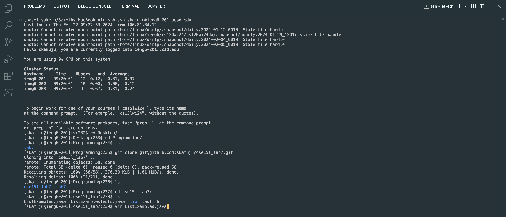
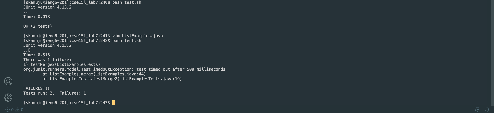
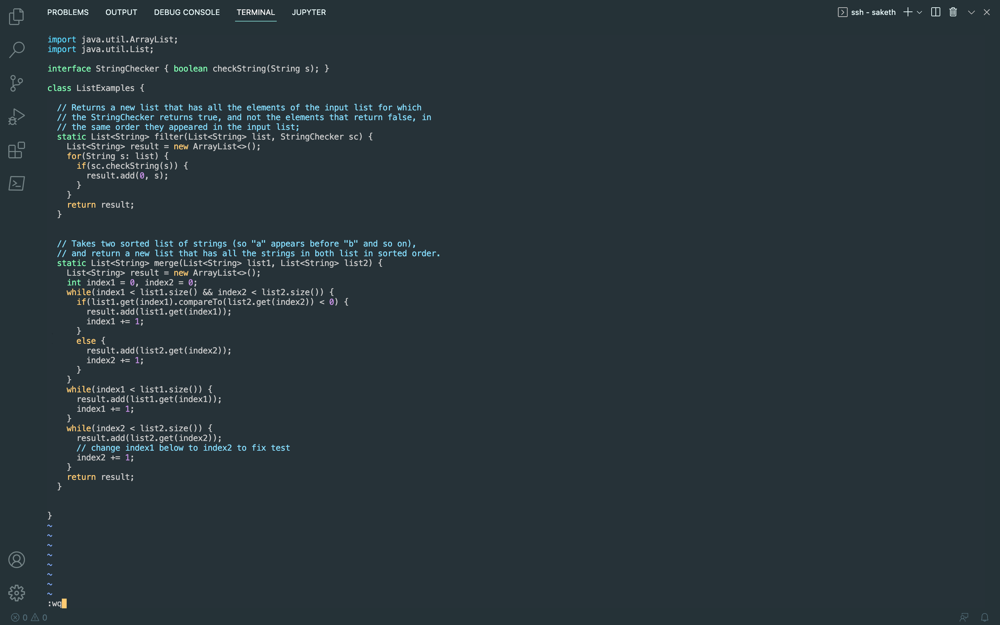
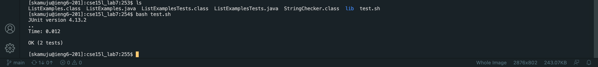
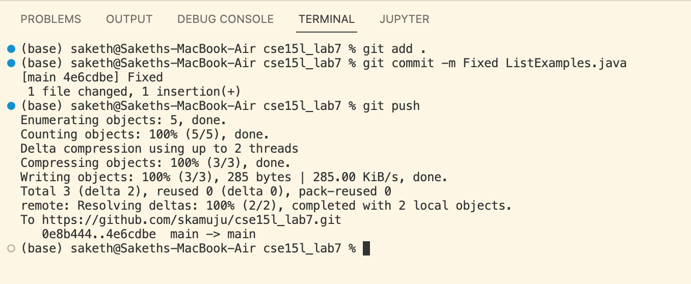

# Lab Report 4
---
* Steps 4-5:
  - 
  - In this screenshot, I log into my ieng6 machine, clone my fork of the git repository with the SSH link, and I type out the command to open up the file we need to fix.
  - To acheive this, I ran `ssh skamuju@ieng6.ucsd.edu` to log into the ieng machine. from there, I ran `cd Des<tab>` as well as a couple more `cd` and `ls` commands, at which point I ran `git clone git@github.com:ucsd-cse15l-s23/lab7.git`, and some more navigation commands ending in `cd cse<tab>` to navigate into the appropriate directory, where finally I ran `vim ListExamples.java`.
* Step 6:
  _ 
  - When completing this lab, I accidentally fixed the file before taking a screenshot showing the tests did not run, so I had to go back, re-break the file, and then run the tests, which is why the screenshot isn't contiguous with the others.
  - To compile and run the code I used `bash test.sh` in the command line, which ran the `test.sh` script that compiles and runs all of the `.java` files in the working directory as well as provides access to the JUnit library.
* Step 7:
  - 
  - To fix this file, I simply changed index1 in the fourth line from the end to index2
  - To acheive this, I input `<control>g`, `<shift>g`, `kkkkkk`, `e`, `x`, `i`, `2`, `<escape>`, `:wq`
  - This series of commands moved me to the end of the file, up to the line I wanted to edit, moved to the end of the word I wanted to edit, delete the 1, insert the 2 afer index, escape insert mode, and finally save and exit the file.
* Step 8:
  - 
  - In this screenshot I ran, `bash test.sh` which compiled and ran tests on the code provided, and after our earier editing, all the tests passed.
* Step 9:
  - 
  - In this screenshot, I specify the changes I want to be pushed to the repository (`git add .` adds all changes made to a commit), I save the changes I made to the files in my commit, created a commit message, and pushed those changes back to tha main branch of my forked repository.
  - The commands I ran were as follows: `git add .` and `git commit -m Fixed ListExamples.java` and `git push`.
  - (This screenshot was taken after I had already finished fixing `ListExamples.java`, and as such the number of changes and the changes pushed in the screenshot are different. I simply added an indentation in the already fixed `ListExamples.java` to display using the `git add`, `git commit`, and `git push` commands.)
