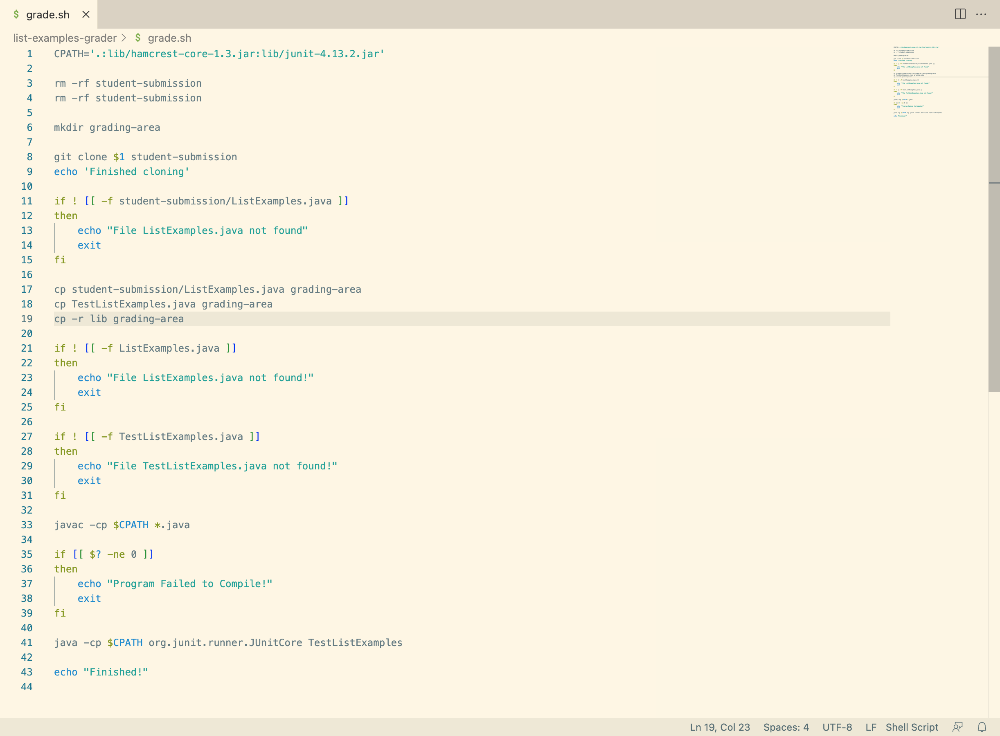

# Lab Report 5
---
* Part 1:
  - Edstem Discussion:
    - Student: I am having some issues with my grading bash script, specifically ensuring that all the files are present and the JUnit test are working before calculating a grade, and I am not sure why it isn't working. I keep getting an issue saying that `ListExamples.java` is not found, even though my `git clone` command successfully runs
    - TA: Can you show me a picture of your Terminal output and your script?
    - Student: Sure. Here is the output and the script in that order:
      - 
      - 
    - TA: It seems like your script cannot find `ListExamples.java` from where it is working in. Maybe consider throwing in an `ls` command to see what your script is looking at when searching for `ListExamples.java`. Try that and get back to me with your output.
    - Student: I tried it and here is my output. I realized that my script is not operating in the right directory, so I added `cd grading-area` right before I search for `ListExamples.java`. My script seems to be working now!
      - 
    - Student: And here is my output now that the script is working:
      - 
    - TA: Good job and good luck on the rest of the assignment!
  - Setup Information:
    - File and Directory Structure:
      - .
    - Contents of files before bugs fixed:
      - .
    - Commands used to trigger the bug(s):
      - `bash grade.sh https://github.com/ucsd-cse15l-f22/list-methods-corrected`
    - A description of what to edit to fix the bug:
      - Since this grading script was not operating in the right directory to access the files it needed to, it was running into errors. To fix that, we addede an `ls` command into the script to figure out what the script was looking through and realize that we needed to change the directory. After that, all that was required was adding `cd grading-area` to ensure that the script was looking in the right place.
* Part 2:
  - During my CSE 15L lab section I had the pleasure of meeting several new people through working with them during class, and lots of new things from many different spheres of programming. One thing that I learned that stood out to me however, was how to use Vim. My main text editor is still VSCode but I found that Vim has been really helpful for certain situations that seem to pop up a lot when programming such as needing to create short scripts for tying together programs or making small changes here or there when programming. Especially after finding Vim tutot, I think I ended up spending a decent amount of time trying to get better at using Vim and how I can cut down the amount of time I spend working on something through various Vim macros.
